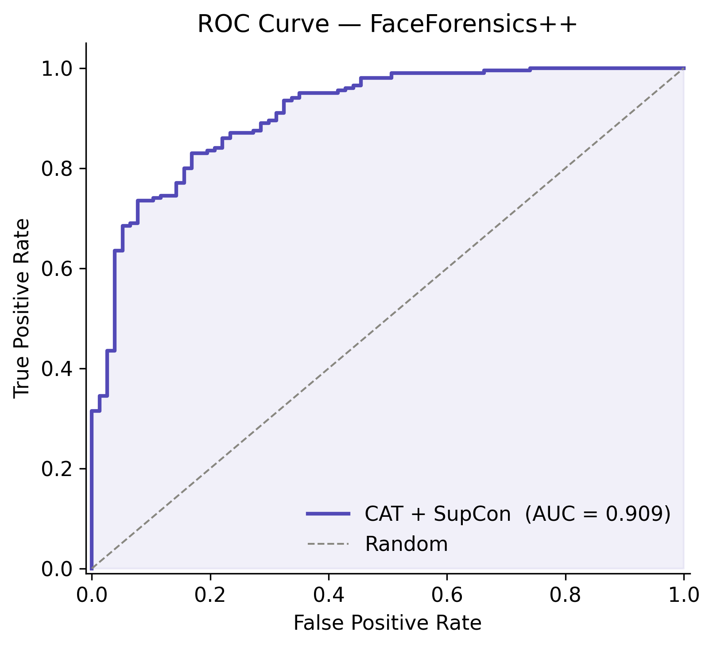
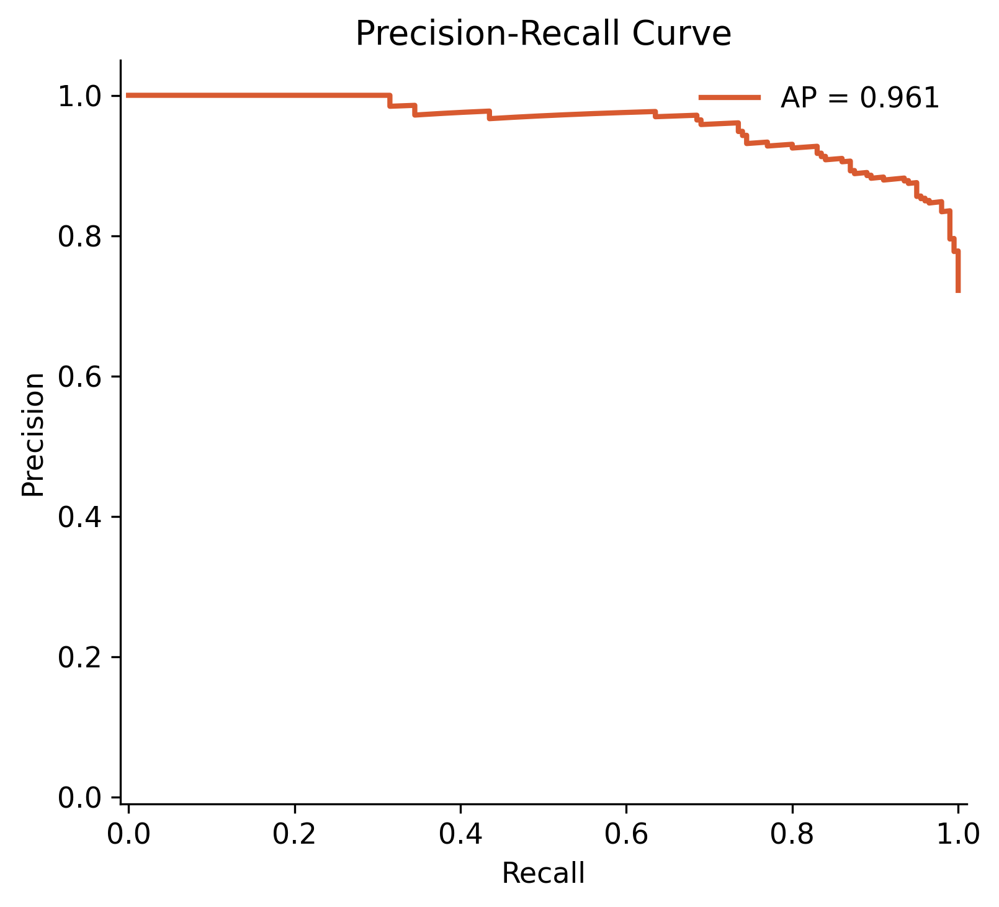
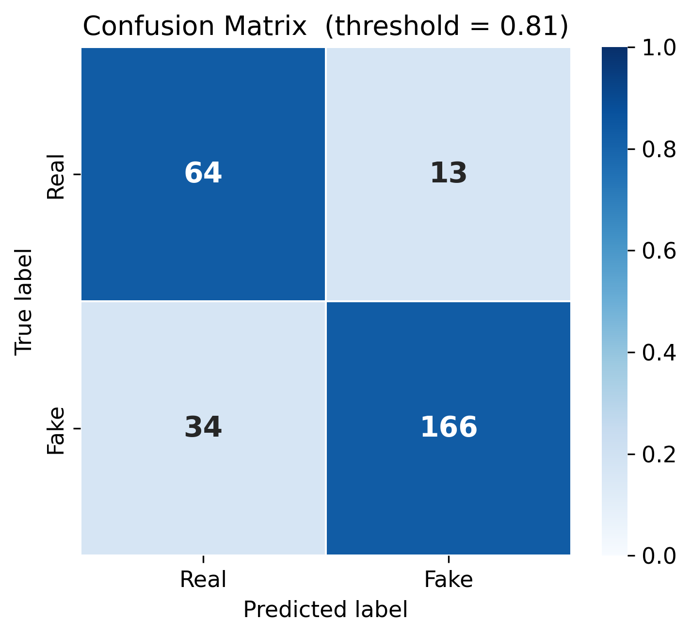
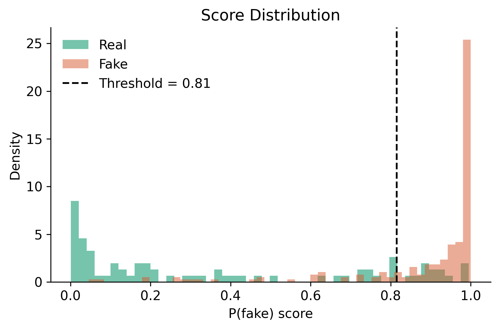
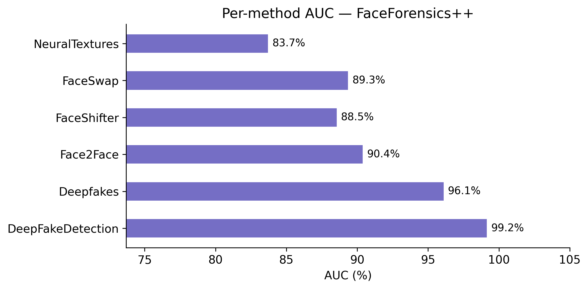
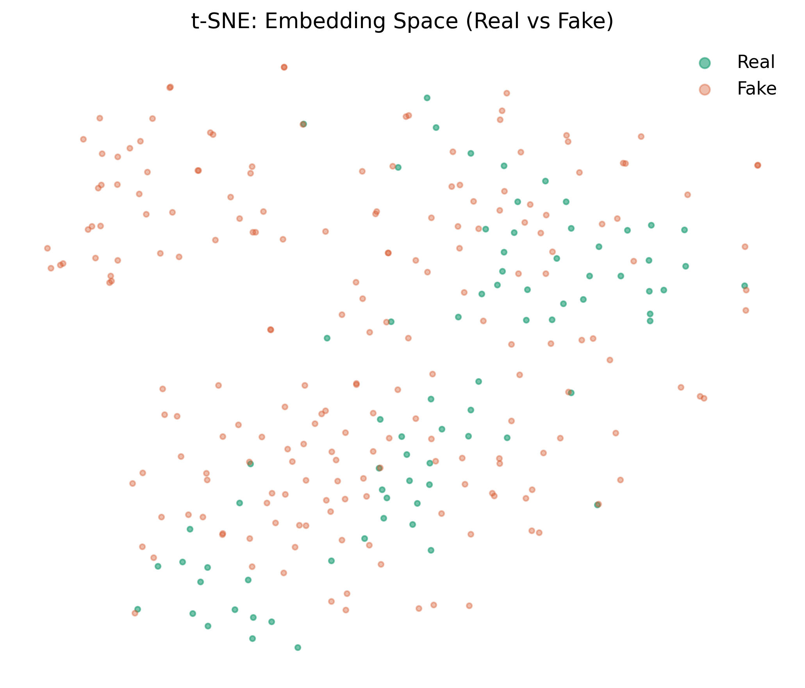

# 🎭 AI-Based Deepfake Video Detection

<div align="center">


</div>

---

## 🧠 Project Overview

This repository contains the official implementation of our academic B.Tech project: **AI-Based Deepfake Video Detection**. The system employs a state-of-the-art **dual-stream transformer architecture** that captures both spatial visual artifacts and temporal inconsistencies to accurately classify a video as real or manipulated.

Unlike conventional frame-by-frame CNN approaches, our solution:
- Analyzes spatial anomalies using a **Vision Transformer (ViT-Base)**.
- Detects unnatural inter-frame motion using a **TimeSformer** operating on frame difference clips.
- Utilizes **Supervised Contrastive Learning (SupCon)** to pull embeddings of the same class closer together and push different classes apart, maximizing the decision boundary margin.
- Exposes a sleek, dark-glassmorphism **Flask API/Web UI** for end users to easily drag-and-drop videos for real-time inference.

---

## 🔬 Core AI Components (CAT Architecture)

Our system achieves its high detection accuracy through a **CAT (Concatenation) Architecture** that unites these advanced mechanisms:

1. **ViT (Vision Transformer)**: The spatial stream that acts as a robust backbone for extracting highly granular visual artifacts (e.g., face blending boundaries, artificial textures) from individual frames.
2. **TimeSformer**: The temporal stream designed to compute self-attention across frame-differences, pinpointing unnatural inter-frame motion, flickering, or micro-expressions over time.
3. **CAT (Concatenated Fusion)**: The late-fusion mechanism where the 512-dim embeddings from both ViT and TimeSformer are effectively concatenated into a unified 1024-dim representation before the classification head.
4. **SupCon (Supervised Contrastive Learning)**: During training, we apply a specialized SupCon loss. Instead of relying purely on Cross-Entropy, SupCon actively tightens the cluster of 'Real' videos and forcefully pushes away the 'Fake' videos in the embedding space, drastically reducing false positives.

---

## 🏗️ System Architecture

Our model processes 16 uniformly sampled frames per video face-crop. The architecture is split into two specialized streams that are concatenated before final classification.

```mermaid
graph TD
    A[Input Video] --> B[MTCNN Face Detector]
    B --> C[16+1 Uniform Face Crops]
    
    C -->|Spatial Stream| D[Middle Face Frame]
    C -->|Temporal Stream| E[Frame Differences t+1 - t]
    
    D --> F[ViT-Base \n 512-dim embedding]
    E --> G[TimeSformer-Base \n 512-dim embedding]
    
    F --> H((Concatenation))
    G --> H
    
    H -->|1024-dim| I[LayerNorm + Linear]
    I --> J[GELU + Dropout]
    J --> K[Linear Projection]
    K --> L{Softmax Classifier}
    
    L -->|P >= 0.815| M[🚨 FAKE]
    L -->|P < 0.815| N[✅ REAL]
    
    style A fill:#2e2e2e,stroke:#fff
    style M fill:#ff4d4d,stroke:#fff,color:#fff
    style N fill:#4caf50,stroke:#fff,color:#fff
```



---

## 📊 Final Output & Results

The model has been rigorously evaluated on the **FaceForensics++** dataset across multiple manipulation methods. The metrics below reflect the peak validation performance using the combined (CAT) model.

### Key Performance Metrics
| Metric | Value |
|:---|:---|
| **Validation AUC** | **90.94%** |
| **Average Precision (PR-AUC)** | 96.06% |
| **Balanced Accuracy** | 83.06% |
| **F1 Score** | 0.876 |
| **Equal Error Rate (EER)** | 16.94% |
| **Optimal Decision Threshold** | 0.815 |

### Confusion Matrix (at Optimal Threshold 0.815)
| | Predicted REAL | Predicted FAKE |
|:---|:---:|:---:|
| **Actual REAL** | 64 (TN) | 13 (FP) |
| **Actual FAKE** | 34 (FN) | 166 (TP) |

### Performance by Manipulation Method (AUC)
The system is highly robust across various deepfake generation techniques:

| Manipulation Method | Validation AUC |
|:---|:---|
| **DeepFakeDetection** | 99.15% |
| **Deepfakes** | 96.10% |
| **Face2Face** | 90.39% |
| **FaceSwap** | 89.35% |
| **FaceShifter** | 88.55% |
| **NeuralTextures** | 83.70% |

> *Note: Full evaluation figures and embedding visualizations are generated in the `results/` directory.*

### 📈 Evaluation Figures

| ROC Curve | Precision-Recall Curve |
|:---:|:---:|
|  |  |
| **Confusion Matrix** | **Score Distribution** |
|  |  |
| **Per-Method AUC** | **t-SNE Embeddings** |
|  |  |

---

## 💻 Tech Stack

- **Deep Learning Framework:** PyTorch 2.0+
- **Model Backbones:** HuggingFace `transformers` (ViT, TimeSformer)
- **Face Detection:** `facenet-pytorch` (MTCNN)
- **Backend API:** Flask, Flask-CORS
- **Frontend UI:** HTML5, CSS3 (Vanilla Glassmorphism), JavaScript
- **Data Augmentation:** `albumentations`
- **Data Processing:** OpenCV (`opencv-python-headless`), NumPy
- **Evaluation:** Scikit-Learn, Matplotlib, Seaborn

---

## 📁 Project Directory Structure

```text
AI-BASED-DEEPFAKE-VIDEO-DETECTION/
│
├── models/
│   ├── cat_model.py          # CATModel + CATModelWithSupCon + FocalLoss + SupConLoss
│   ├── vit_stream.py         # ViT spatial stream
│   ├── timesformer_stream.py # TimeSformer temporal stream
│   └── supcon_loss.py        # Supervised Contrastive Loss
│
├── data/
│   ├── dataset.py            # FaceForensicsDataset — dual-stream handler
│   ├── preprocess.py         # MTCNN face extraction → .npy files
│   └── processed/            # Dataset metadata (records.json)
│
├── configs/
│   └── config.yaml           # Centralized hyperparameters
│
├── static/                   # Frontend Web UI (Dark Glassmorphism)
│   ├── index.html
│   ├── style.css
│   └── script.js
│
├── results/                  # Evaluation figures and serialized metrics
│   ├── metrics.json          # Complete evaluation statistics
│   └── *.png                 # ROC, PR, t-SNE plots
│
├── checkpoints/              # Directory for model weights
│
├── train.py                  # Full training loop (resume-capable)
├── evaluate.py               # Full evaluation script
├── inference.py              # CLI single-video inference
├── demo.py                   # Gradio web demo
├── app.py                    # Flask REST API backend
├── diagnose.py               # Debugging & validation script
└── requirements.txt
```

---

## ⚙️ Setup & Installation

### 1. Clone the Repository
```bash
git clone https://github.com/sRotrik/AI-BASED-DEEPFAKE-VIDEO-DETECTION.git
cd AI-BASED-DEEPFAKE-VIDEO-DETECTION
```

### 2. Environment Setup
```bash
python -m venv venv

# On Windows:
venv\Scripts\activate
# On macOS/Linux:
source venv/bin/activate
```

### 3. Install Dependencies
```bash
pip install -r requirements.txt
```
*(Ensure you have the correct PyTorch version for your CUDA toolkit, e.g., `--index-url https://download.pytorch.org/whl/cu121`)*

### 4. Download Model Weights
Due to file size constraints, the best checkpoint (`best_model.pth`) is **not** included in the repository. Please download it from the project releases page and place it in the `checkpoints/` directory.

---

## 🚀 Usage Guide

### 1. Web UI Dashboard (Flask)
For a premium, interactive experience, start the Flask web server:
```bash
python app.py
```
Open your browser and navigate to `http://127.0.0.1:5000`. You can drag-and-drop videos directly into the UI to get real-time detection results, complete with confidence scores and verdict visualizations.

### 2. Command-Line Inference
To quickly test a single video via the terminal:
```bash
python inference.py --video path/to/sample.mp4
```

### 3. Training the Model
To reproduce the training process from scratch:
```bash
# 1. Preprocess the dataset to extract faces
python data/preprocess.py

# 2. Start training
python train.py
```

### 4. Diagnostics & Debugging
If you encounter data loading or model forward-pass issues, run the diagnostic script:
```bash
python diagnose.py
```

---

## 👥 Project Team

| Name | Register No. | Role | Email |
|:---|:---|:---|:---|
| **Reshma K** | RA2311003011843 | Data pipeline, SupCon loss, Evaluation | rk6362@srmist.edu.in |
| **Srotrik Pradhan** | RA2311003011860 | Model architecture, Training infra, Web app | sp8087@srmist.edu.in |

**Academic Supervisor:** Dr. Shyni Shajahan (Assistant Professor, CTECH Dept.)  
*SRM Institute of Science and Technology, Kattankulathur — 603203*

---

## 📄 License

This project is developed for academic purposes under SRM IST (Course 21CSP302L).  
Source code is released under the [MIT License](LICENSE).

---

## 🔗 Key References

1. **FaceForensics++:** [Rössler et al., ICCV 2019](https://github.com/ondyari/FaceForensics)
2. **Vision Transformer:** [Dosovitskiy et al., ICLR 2021](https://arxiv.org/abs/2010.11929)
3. **TimeSformer:** [Bertasius et al., ICML 2021](https://arxiv.org/abs/2102.05095)
4. **Supervised Contrastive Learning:** [Khosla et al., NeurIPS 2020](https://arxiv.org/abs/2004.11362)
5. **MTCNN:** [Zhang et al., IEEE Signal Processing Letters 2016](https://arxiv.org/abs/1604.02878)
